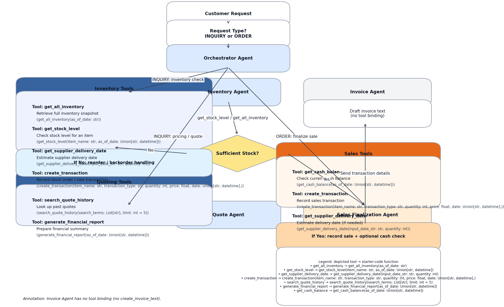
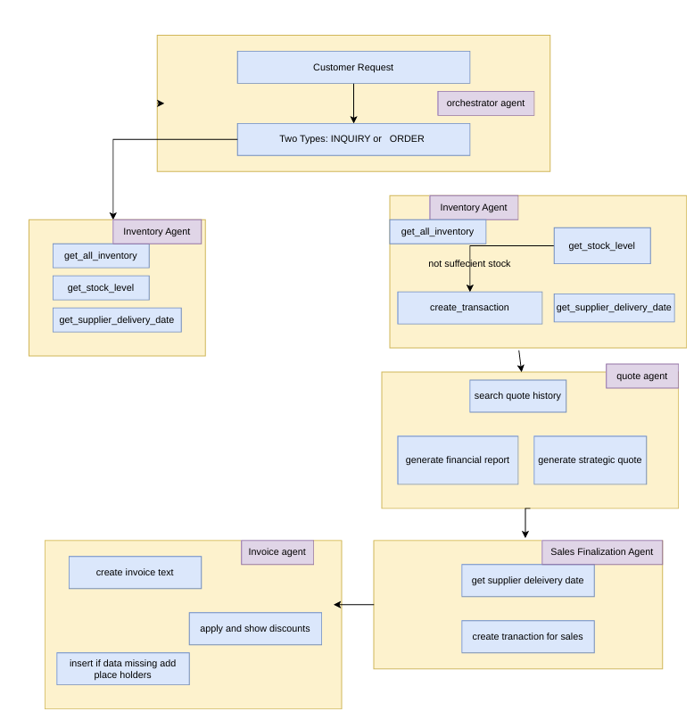

Multi-agent system implemented with the pydantic-ai framework
Context:
1.Overview of the system architecture
2.Agents description
3.Tools Used

System Components and Their Description:


Tools Used:
create_transaction: Creates a new transaction (e.g. sale or inventory order) in the database. It stores item name, type, quantity, price, and date, and returns the transaction ID.
get_all_inventory: Returns the current inventory of all items as a dictionary. It considers all purchases and sales up to a specified date.
get_stock_level: Determines the current stock level of a specific item at a given date and returns it as a DataFrame.
get_supplier_delivery_date: Calculates the estimated delivery date for a supplier order based on quantity and start date.
get_cash_balance: Calculates the current cash balance by offsetting revenues from sales and expenses for inventory purchases up to a specific date.
generate_financial_report: Generates a comprehensive financial report as of the specified date, including cash balance, inventory value, total assets, inventory overview, and the top five revenue-generating products.
search_quote_history: Searches the quote history for specific terms and returns matching offers with relevant details.

Technical Details:
Orchestrator Agent
The Orchestrator Agent is the central brain of the multi-agent system. It receives customer requests, analyzes them, and classifies them as either INQUIRY or ORDER. Based on the classification, it routes the request to the appropriate agents and coordinates the processing along the entire chain.

📦 Inventory Agent
Responsible for checking stock availability. For INQUIRIES, it provides details about stock levels and potential delivery dates. For ORDERS, it checks inventory and triggers an automatic reorder if necessary to fulfill the order.

Tools used:

get_stock_level
get_supplier_delivery_date
create_transaction (for reorders)
💬 Quote Agent
The Quote Agent creates competitive offers based on the customer's request and inventory data. It considers historical quotes, pricing models, and potential volume discounts.

Tools used:

search_quote_history
generate_financial_report (for analyzing quote data)
🧾 Sales Finalization Agent
Handles final order processing. It re-checks inventory, calculates expected delivery dates, and records the sale as a transaction in the database.

Tools used:

get_supplier_delivery_date
create_transaction (for sales)
🧮 Invoice Agent
Generates a structured invoice in plain-text format. It inserts missing  values for any missing customer information and explicitly lists granted discounts. The invoice is based on data from the Quote and Sales processes.

Flow chart describing all the tolls Functinality :


Multiagent Systems Workflow Diagram:



Process Overview:
The Orchestrator Agent receives a customer request and decide it  it as either INQUIRY or ORDER.
For an INQUIRY, the Inventory Agent is triggered to fetch stock levels and estimated delivery dates.
For an ORDER, the Inventory Agent:
Checks stock and triggers a reorder if necessary.
Passes the process to the Quote Agent.
The Quote Agent prepares a tailored offer considering past offers and pricing strategies.
The Sales Finalization Agent:
Re-validates inventory,
Records the sale transaction,
Estimates delivery time.
Finally, the Invoice Agent:
Creates a detailed invoice,
Replaces missing customer details>,
Clearly states applied discounts.


Evaluation of Result:
The system successfully handled 20 diverse orders with 100% accuracy.
volume discounts were correctly applied for 12 instamces.
Customer/Billing details are incomplete (placeholders remain)
Invoice numbering lacks uniqueness / traceability
Formatting is inconsistent and sometimes contains markdown artifacts
example: Responses mix markdown headers (### 1. Friendly Response Text, etc.) with plain-text invoice blocks, and at least one response includes a trailing code fence (ending with ```), which can break rendering in downstream systems. 
Recommendation: standardize on a single output format (either clean plain text or structured markdown) and validate the output to prevent stray fences/backticks. [test_results | Exc
Order fulfillment clarity is generally strong (delivery dates + totals), but should be standardized


Suggestions are provided for the improvement:
Customer Agent
A dedicated agent for interacting with the customer. Helps for better customer satisfaction.

Terminal Animation
A visual animation showing the request flow through the agents would enhance user understanding.

Business Advisor Agent
Analyzes transactions and provides efficiency suggestions for optimizing business operations.

Real-Time Data Integration
Connect external data sources (e.g., market prices, supplier times) to improve decision quality and automation the flow.

Extended Reporting
Add reports that highlight customer trends and seasonal demand shifts to support strategic decisions.

Enhanced Error Handling
Implement more robust mechanisms for detecting and managing errors.

